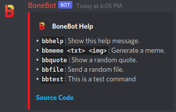

# BoneBot

## About

BoneBot is a self-hosted, modular Discord bot that can respond and react to messages, add custom commands, send random
files and quotes, and generate memes on demand to add more life to a Discord server.

## Purpose

BoneBot was originally written as a meme-generating Discord bot for the ISUCF'V'MB Trombone and Bass Trombone Discord
server. The bot also has functionality to respond and react to messages and commands. This is utilized as a way to add
helpful commands to the server to show links for online folders and band information.

## Usage

### Meme Generator

The meme generator will generate a meme with top and bottom text in Impact font.

##### Command

- `bbmeme`
- `bbmeme <image> <top text> \n <bottom text>` (Can also press shift+enter instead of `\n`)

##### Image input

- Image (PNG, JPG)
- Image link (PNG, JPG)
- User ping (Grabs their avatar)
- Image from an embed (PNG, JPG)
- Any of the above from a reply
    - Note: main message input will override reply input
- Random image (If properly configured and no image is provided)

##### Text input

- Text in your message
- Text in a reply (If no image is in the reply)
    - Note: main message input will override reply input
- Random text (If properly configured and no text is provided)

If you make a mistake in typing the command, or wish to generate another meme with similar inputs, you can edit the
message to fix it without needing to send another message.

### Files

The file module will send a random file from `resources/files`. This can be an image, video, text file, audio file, etc.
A specific file can also be sent from the `resources/files` folder

##### Command

- `bbfile`
- `bbfile <path>`

##### File input

- Only works for files in `resources/files`
- If not specified, a random file will be sent.
    - Specifying a sub-directory for the path will grab a random file from within that directory.

### Quotes

The quote module will send a random quote from a file.

##### Command

`bbquote`

### Responder

The responder will respond to a message with another when a trigger phrase is sent in a message or an edit. It can
appear like it is typing the message itself!

### Reactor

The reactor will react to a message with an emote when a trigger phrase is sent in a message or an edit.

### Commands

BoneBot allows for custom commands to be made to provide text and image responses and run shell commands. Their usage is
pretty simple - a command called `test` would be used by typing `bbtest`. If you make a mistake in typing a command, you
can edit the message to fix it without needing to send another message. This module can provide simple ping-pong style
commands, or more complex commands as needed. Some fantastic examples of custom commands can be
found [here](https://github.com/diademiemi/BoneBot-Scripts).

### Statuses

BoneBot can have various randomized statuses shown in Discord that change over time.

### Welcomer

The welcomer will send a private message to new users who join to welcome them to the server. This can be used to show
server rules and an explanation of how to get started.

## Requirements

Any version of Windows, macOS, or Linux that can run Java 11 or later.

## Building

1. Clone or download this repository.
2. Run `./gradlew shadowJar` in the directory of the project.
3. `/build/libs/BoneBot.jar` should have been generated.

You can also grab `BoneBot.jar` from the latest releases.

## Installation

### Manual

Place `BoneBot.jar` where you would like it to be installed.

### Systemd

1. Place `BoneBot.jar` where you would like it to be installed.
2. Create the following `bonebot.service` file in `/etc/systemd/system/`, making sure to change the `WorkingDirectory`
   and `ExecStart`, as well as the `User`:

```ini
[Unit]
Description=Service to start BoneBot
After=network-online.target

[Service]
WorkingDirectory=/path/to/BoneBot-folder
ExecStart=/usr/bin/java -jar /path/to/BoneBot.jar
User=set_user_here
Restart=always

[Install]
WantedBy=multi-user.target
```

### Docker

1. Create the following `Dockerfile` wherever you would like:

```Dockerfile
FROM ubuntu:20.04 as runtime
ENV DEBIAN_FRONTEND=noninteractive

RUN apt update
RUN apt install default-jre-headless wget locales -y

WORKDIR /app

RUN wget https://github.com/jeremynoesen/BoneBot/releases/download/1.7.2/BoneBot.jar

RUN locale-gen en_US.UTF-8
ENV LANG en_US.UTF-8
ENV LANGUAGE en_US:en
ENV LC_ALL en_US.UTF-8

ENTRYPOINT ["java", "-jar", "BoneBot.jar"]
```

2. Create the following `docker-compose.yml` wherever you would like, making sure to change the `context` to the path of
   the directory containing the `Dockerfile`, and `volumes` to wherever you would like the volume to be stored:

```yaml
version: '3'
services:
  bonebot:
    container_name: bonebot
    build:
      context: /path/to/dir/containing/Dockerfile/
    restart: unless-stopped
    network_mode: host
    volumes:
      - /path/to/volume:/app/resources
```

## Bot Application

You must create a Discord Application before you continue. This creates the bot user that will be used to run the bot.

1. Head over to the [Discord Developer Portal](https://discord.com/developers/applications) and create an application.
2. Add a bot to the application in the "Bot" tab.
3. Give the bot the following intents:
    - Server Members Intent
    - Message Content Intent
4. Copy the bot token from this page. You will need it later.
5. Invite the bot using this link, replacing `CLIENT_ID` with the application ID from the "General Information"
   tab: https://discord.com/api/oauth2/authorize?client_id=CLIENT_ID&permissions=379968&scope=bot
6. Give the bot the following user/role permissions:
    - View Channels
    - Send Messages
    - Embed Links
    - Attach Files
    - Add Reactions
    - Use External Emoji
    - Read Message History

## Running

All methods of running for the first time will generate all necessary configuration files and folders, but will fail to
start the bot. You will need to set `bot-token` in `resources/config.txt` to the token you copied earlier for the bot to
start.

### Manual

Run `cd /path/to/BoneBot-folder && java -jar BoneBot.jar` to start the bot.

### Systemd

Run `sudo systemctl enable bonebot && sudo systemctl start bonebot` to start the service and allow it to start on boot.

### Docker

Run `docker compose up -d` in the directory of `docker-compose.yml` to start the container.

## Configuration

**After changing any of text configurations, save the file and restart the bot.**

### Placeholders

Use these placeholders in most configurations. Places they are disallowed will be specified per module. Module-specific
placeholders will also be specified per module.

- `$PING$` - Place a ping of the author in the message.
- `$NAME$` - Place the author's name in the message.
- `$BOT$` - Place the bot's name in the message.
- `$GUILD$` - Place the guild's name in the message.
- `$REPLY$` - Send the message as a reply to the author.
- `\n` - Place a new line character in the message.

### Meme Generator

- Images for the randomizer are to be placed in the `resources/memeimages` folder. They must be PNG or JPG format.
- Texts for the randomizer are to be placed in `resources/memetexts.txt`.
    - Each separate line denotes a separate text.
    - The format is `<top text> \n <bottom text>`.
- Text input can use all placeholders except for `$REPLY$`.
- To set the size of generates memes, set `memes-size` in the main configuration to any number. This limits the larger
  dimension to this value, and scales the other dimension accordingly. Set it to `0` to use the image's original
  dimensions with no scaling.
- To set the font size of text, set `memes-font-scale` in the main configuration. It defaults to `1.0`.
- To set a cool down for the generator, set `memes-cooldown` in the main configuration to any whole number in seconds.
- To enable or disable the generator, set `memes-enabled` in the main configuration to `true` or `false`.

### Quotes

- Quotes will be put into `resources/quotes.txt`.
- Each line designates a new entry.
- Quotes can use all placeholders except `$REPLY$`.
- To set a cool down for quotes, set `quotes-cooldown` in the main configuration to any while number in seconds.
- To enable or disable quotes, set `quotes-enabled` in the main configuration to `true` or `false`.

### Files

- Files will be put into `resources/files`.
- To set a cool down for files, set `files-cooldown` in the main configuration to any whole number in seconds.
- To enable or disable files, set `files-enabled` in the main configuration to `true` or `false`.

### Responder

- Responses will be put into `resources/responses.txt`.
- Each line designates a new entry.
- The format is `trigger: response`.
- Append ` $&&$ response` to add a multi-message response.
- Append ` $||$ response` to have multiple messages to randomly choose from for a response.
- Case is ignored in the trigger.
- The trigger can include Regex. Case is not ignored if you use Regex.\
- Trigger can use all placeholders except for `$REPLY$`.
- The response can include all placeholders.
- You can send a single file by adding `$FILE$ path/to/file $FILE$`.
- The response sends with a delay based on message length multiplied by `responder-typing-speed` in the main
  configuration in milliseconds. This number must be a whole number.
- To set a delay between when the message is sent and when the bot starts to respond, set `responder-delay` in the main
  configuration to any whole number in milliseconds.
- To set a cool down for the responder, set `responder-cooldown` in the main configuration to whole any number in
  seconds.
- To enable or disable the responder, set `responder-enabled` in the main configuration to `true` or `false`.

### Reactor

- Reactions will be put into `resources/reactions.txt`.
- Each line designates a new entry.
- The format is `trigger: emote`.
- Append ` $&&$ emote` to add a multi-emote reaction.
- Append ` $||$ emote` to have multiple emotes to randomly choose from for a reaction.
- Case is ignored in the trigger.
- The trigger can include Regex. Case is not ignored if you use Regex.
- Trigger can use all placeholders except for `$REPLY$`.
- For the emote, you can put either a unicode emoji, `U+1F980`, or a raw discord emote, `:bonebot:819645061200347177`.
- To set a delay between when the message is sent and when the bot reacts, set `reactor-delay` in the main configuration
  to any whole number in milliseconds.
- To set a cool down for the reactor, set `reactor-cooldown` in the main configuration to any whole number in seconds.
- To enable or disable the reactor, set `reactor-enabled` in the main configuration to `true` or `false`.

### Commands

- Commands will be put into `resources/commands.txt`.
- Each line designates a new entry.
- The format is `command: description: response`.
- Append ` $&&$ response` to add a multi-message response.
- Append ` $||$ response` to have multiple messages to randomly choose from for a response.
- Do not put the prefix in the command.
- The response and description can include all placeholders.
    - Description can not include `$REPLY$`
- You can send a single file by adding `$FILE$ path/to/file $FILE$`.
- You can add a reaction to the command trigger message by adding `$REACT$ emote $REACT$`. Format for emotes is similar
  to the reactor.
- You can have the command send as an embed instead by using `$EMBED$ embed title here $EMBED$`.
    - If the embed title has the author's name, the bot's name, or the guild's name, the author icon will be set to
      their image.
- You can run a shell command by adding `$CMD$ command here $CMD$`.
    - Need to run multiple commands? Make a shell script and run the script with a command, or separate commands with a
      semi-colon!
    - Add `$CMDOUT$` to your response to also include the output of this command in the response.
    - If the above would return a file path, you can surround it with `$FILE$` to send that file.
    - You can accept input from the Discord command by using path variables within the `$CMD$` blocks. These can be used
      by doing `${VARIABLE}` in Linux and macOS, or `%VARIABLE%` in Windows. To view what variables are available and
      what they are set to, check out the bottom of `modules/commands/Commands.kt`. There are too many variables, so
      they are not listed here.
- To change the command prefix, set `commands-prefix` in the main configuration to a custom prefix. Case is ignored.
- To set a cool down for commands, set `commands-cooldown` in the main configuration to any whole number in seconds.
- To enable or disable commands, set `commands-enabled` in the main configuration to `true` or `false`. This will
  disable all built in command modules as well.

### Statuses

- Statuses will be put into `resources/statuses.txt`.
- Each line designates a new entry.
- Each line must start with `playing`, `watching`, or `listening to`.
- The only placeholder that works for statuses is `$BOT$`.
- The main config has option `statuses-delay` to set how long each status shows in seconds as a whole number.
- To enable or disable statuses, set `statuses-enabled` in the main configuration to `true` or `false`.

### Welcomer

- The welcome message is located `resources/messages.txt` under `welcome-message`.
- The welcomer can use all placeholders except `$REPLY$`.
- You can send a single file in the embed by adding `$FILE$ path/to/file $FILE$`.
- To enable or disable the welcomer, set `welcomer-enabled` in the main configuration to `true` or `false`.

### Messages

- All messages built in to the bot are editable, located in `resources/messages.txt`.
- Messages can include all placeholders
    - `$PING$` and `$REPLY$` can not be used for embed titles.
    - Command labels can not use any placeholders.
- Standard Discord Markdown formatting is supported.
- This file can modify all built-in responses, command descriptions, and commands.
- The `help-about` message can include a file foe the embed using the `$FILE$` format.

### Miscellaneous

- You can change the colors of embeds for the meme generator and help message by setting `embed-color` in the main
  configuration to a hex code.
- You can allow BoneBot to listen to input from other bots by setting `listen-to-bots` to `true`. It defaults
  to `false`.
- BoneBot spawns new threads to process every message, edit, and member join. To limit the maximum number of worker
  threads at a time, set `max-threads` to any integer. 0 or lower removes the limit.
- You can make other files and directories in the bot folder as needed for your own organization of files the bot may
  use, but not for the files the bot requires.

### Defaults

##### Main Configuration

Located at `resources/config.txt`

```
responder-enabled: true
responder-cooldown: 180
responder-delay: 1000
responder-typing-speed: 100
reactor-enabled: true
reactor-cooldown: 60
reactor-delay: 1000
memes-enabled: true
memes-cooldown: 5
memes-size: 1200
memes-font-scale: 1.0
statuses-enabled: true
statuses-delay: 60
commands-enabled: true
commands-cooldown: 5
commands-prefix: bb
quotes-enabled: true
quotes-cooldown: 5
files-enabled: true
files-cooldown: 5
welcomer-enabled: true
listen-to-bots: false
max-threads: 8
embed-color: #fd0605
bot-token: TOKEN
```

##### Messages

Located at `resources/messages.txt`

```
help-title: $BOT$ Help
help-about: $BOT$ aims to add more life to a server by responding and reacting to messages. It also adds commands, which are listed below.
help-format: • **`$CMD$`**: $DESC$
help-description: Show this help message.
meme-description: Generate a random or custom meme.
file-description: Send a random or specific file.
quote-description: Send a random quote.
help-command: help
meme-command: meme
file-command: file
quote-command: quote
meme-title: $NAME$ generated a meme:
welcome-title: $NAME$ joined $GUILD$
quote-title: "$NAME$ summoned a quote:"
file-title: "$NAME$ summoned a file:"
welcome-message: "Welcome $PING$ to **$GUILD$**!"
error: **An error occurred!** Please check the console!
unknown-command: **Unknown command!**
no-files: There are **no files** to send!
unknown-file: **Unknown file!**
meme-input-missing: Please provide the missing **text** and/or **image**!
no-quotes: There are no quotes to show!
meme-cooldown: Another meme can be generated in **$TIME$** seconds.
file-cooldown: Another file can be sent in **$TIME$** seconds.
quote-cooldown: Another quote can be sent in **$TIME$** seconds.
command-cooldown: Commands can be used again in **$TIME$** seconds.
```

## Demonstration

Below are a few images showing what BoneBot can do. Simple actions, such as reactions, text responses, and status
messages, are not shown due to those being basic Discord functions.

### Meme Generator

The following image is an example of the meme generator using a user's avatar, as well as top and bottom texts:

<div align="center"></div>

### Help Command

The following image is an example of the help command, with some built-in commands disabled and some custom commands
added:

<div align="center"></div>
