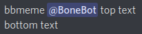

# BoneBot

## About
BoneBot is a self-hosted, modular Discord bot that can respond and react to messages, add text-based commands, and generate memes on demand to add more life to a Discord server.

## Purpose
BoneBot was originally written as a meme-generating Discord bot for the ISUCF'V'MB Trombone and Bass Trombone Discord server. The bot also has functionality to respond and react to messages and commands. This is utilized as a way to add helpful commands to the server to show links for online folders and band information.

## Usage

### Meme Generator
The meme generator will generate a meme with top and bottom text in Impact font.
##### Command
`bbmeme <image> <top text> // <bottom text>` (Can also press shift+enter instead of ` // `)
##### Image input
- Image (PNG, JPG)
- Image link (PNG, JPG)
- User ping (Grabs their avatar)
- Image from an embed (PNG, JPG)
- Any of the above from a reply  
  - Note: main message input will override reply input
- Random image (If properly configured)
##### Text input
- Text in your message
- Text in a reply (If no image is in the reply)
  - Note: main message input will override reply input
- Random text (If properly configured)

### Responder
The responder will respond to a message with another when a trigger phrase is said.

### Reactor
The reactor will react to a message with an emote when a trigger phrase is said.

### Commands
BoneBot allows for custom commands to be made to provide simple message responses. Their usage is pretty simple - a command called `test` would be used by typing `bbtest`.

### Statuses
BoneBot can have various randomized statuses shown in Discord that change over time.

## Requirements
Any version of Windows, macOS, or Linux that can run Java 8 or later.

## Building
1. Clone or download this repository.
2. Run `./gradlew build` in the directory of the project.
3. A file called `BoneBot.jar` should have been created.  

You can also grab `BoneBot.jar` from the latest releases.

## Installation
1. Create a new folder where you would like the bot to be installed. 
2. Place `BoneBot.jar` in this directory.
3. Head over to the [Discord Developer Portal](https://discord.com/developers/applications) and create an application.
4. Add a bot to the application in the bot tab.
5. Copy the bot token from this page. You will need it later.

## Running
Use the commands below, replacing `botdir` with the directory you placed the bot in. Running for the first time will generate all necessary configuration files and folders, but will fail to start the bot. You will need to set `bot-token` in `resources/config.txt` to the token you copied earlier for the bot to start.
```
cd botdir
java -jar BoneBot.jar
```

## Configuration
**After changing any of text configurations, save the file and restart the bot.**

### Meme Generator
- Images for the randomizer are to be placed in the `resources/images` folder. They must be PNG or JPG format.
- Texts for the randomizer are to be placed in `resources/texts.txt`.
  - Each separate line denotes a separate text.
  - The format is `<top text> // <bottom text>`.
- To set a cool down for the generator, set `meme-generator-cooldown` in the main configuration to any number. Time is in seconds.
- To enable or disable the generator, set `meme-generator-enabled` in the main configuration to `true` or `false`.

### Responder
- Responses will be put into `resources/responses.txt`.
- Each line designates a new entry.
- The format is `trigger // response`.
- Case is ignored in the trigger.
- The trigger can include Regex.
- The response can include `\n` as a line separator.
- You can also include `$USER$` in the response to ping the user who invoked a response, or `$REPLY$` to reply to them.
- The response sends with a delay based on message length multiplied by `typing-speed` in the main configuration in milliseconds.
- To set a cool down for the responder, set `responder-cooldown` in the main configuration to any number. Time is in seconds.
- To enable or disable the responder, set `responder-enabled` in the main configuration to `true` or `false`.

### Reactor
- Reactions will be put into `resources/reactions.txt`.
- Each line designates a new entry.
- The format is `trigger // emote`.
- Case is ignored in the trigger.
- The trigger can include Regex.
- For the emote, you can put either a unicode emoji, `U+1F980`, or a raw discord emote, `:bonebot:819645061200347177`.
- To set a cool down for the reactor, set `reactor-cooldown` in the main configuration to any number. Time is in seconds.
- To enable or disable the reactor, set `reactor-enabled` in the main configuration to `true` or `false`.

### Commands
- Reactions will be put into `resources/commands.txt`.
- Each line designates a new entry.
- The format is `command // description // response`.
- Do not put the prefix in the command.
- The response can include `\n` as a line separator.
- You can include `$USER$` in the response to ping the user who used the command, or `$REPLY$` to reply to them.
- To change the command prefix, set `command-prefix` in the main configuration to a custom prefix. Case is ignored.
- To set a cool down for commands, set `commands-cooldown` in the main configuration to any number. Time is in seconds.
- To enable or disable commands, set `commands-enabled` in the main configuration to `true` or `false`.

### Statuses
- Statuses will be put into `resources/statuses.txt`.
- Each line designates a new entry.
- Each line must start with `playing`, `watching`, or `listening to`.
- The main config has option `status-delay` to set how long each status shows in seconds.
- To enable or disable statuses, set `statuses-enabled` in the main configuration to `true` or `false`.

### Miscellaneous
You can change the colors of embeds for the meme generator and help message by setting `embed-color` in the main configuration to a hex code.

### Default Main Configuration
Located at `resources/config.txt`
```yaml
responder-enabled: true
reactor-enabled: true
meme-generator-enabled: true
statuses-enabled: true
commands-enabled: true
responder-cooldown: 180
reactor-cooldown: 60
meme-generator-cooldown: 5
status-delay: 60
command-cooldown: 5
command-prefix: bb
embed-color: #fd0605
typing-speed: 100
bot-token: TOKEN
```

### Permissions
The following Discord permissions are required for BoneBot to work:
- View Channels
- Send Messages
- Embed Links
- Attach Files
- Add Reactions
- Use External Emoji
- Read Message History

## Demonstration
Below are a few images showing what BoneBot can do. Simple actions, such as reactions, text responses, and status messages, are not shown due to those being basic Discord functions.

### Meme Generator
The following is an example command sent to the bot to generate a meme with top and bottom text, as well as a user's avatar as the image input. The next image is the output of this command.

<div align="center"></div>
<div align="center"></div>

### Help Command
The following image is an example of the help command with one custom command added.

<div align="center"></div>

## Notice
This project is no longer in development.